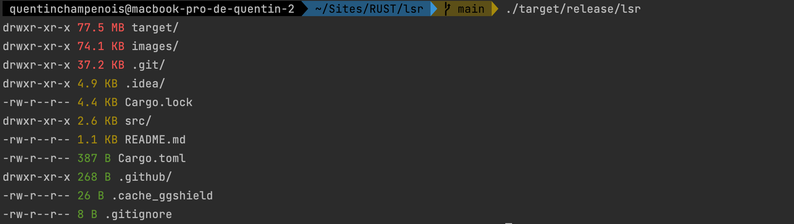

# LSR (ls Rust)

List files of target directory and display files and directories with their current weight in a colored human readable format.

## Objectives

The objectives of this project are :

- [x] Listing files with their current weight
- [x] Group recursively weight of files under a directory
- [ ] Add creation date, permission, ownership of each file
- [ ] Turn project into CLI
- [ ] List heaviest files in the whole filesystem
- [ ] Add tests

## Getting started

1. Build project `cargo build`
2. Execute binary `./target/debug/lsr`

Or 

1. Run main file `cargo run`

## Contributing

This project will probably not be ready for production, however if you want to learn Rust or if you have knowledge and want to contribute on a little project, you are welcome !

**Disclaimer**:
This project is only for practicing and learning Rust language. Bad practices and inconsistencies may be present in project, the aim is to be able to detect them and fix it correctly.
